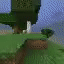

# TreeChop with Behavioural Cloning

## Run rollout with trained model

```python
import gym
import minerl

from model import ConvNetRGB  # import needed for torch.load
from utils import load_model
from wrapper import FrameSkipWrapper
from validate import rollout

env = FrameSkipWrapper(gym.make("MineRLTreechop-v0"))
env.make_interactive(port=6666, realtime=True)
    
model = load_model("models/stack1_BCE_50_1200_rgb")

# will save rollout video on ./video/model_name/
rollout(env, model, max_steps=500, video=True)  
```

Also, to interact with the agent during rollout (after the world is created):

```bash
python -m minerl.interactor 6666
```

# Example Agent Trajectory


